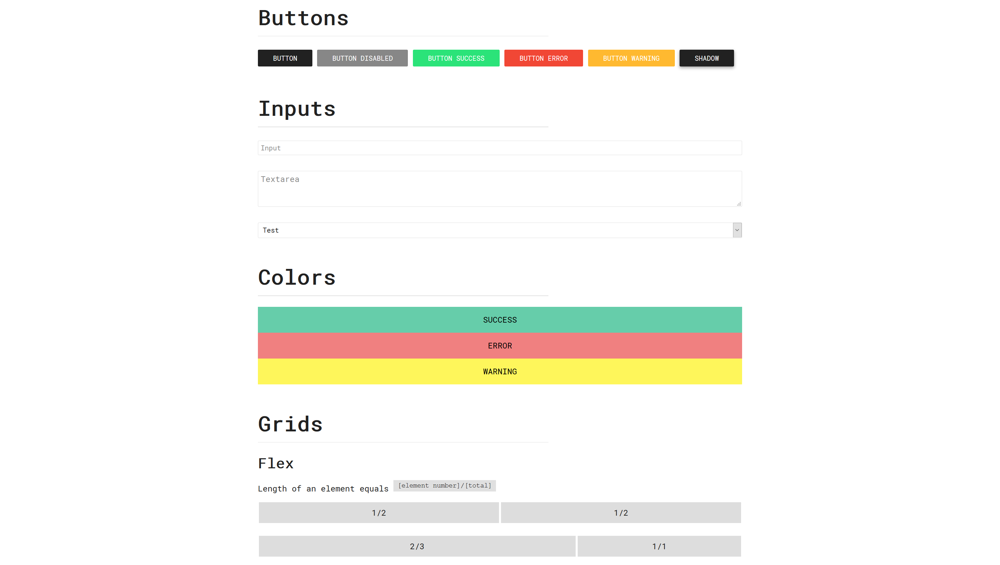

# `PrefaceCSS`

[](https://github.com/cluzier/PrefaceCSS/issues)
[](https://github.com/cluzier/PrefaceCSS/network)
[](https://github.com/cluzier/PrefaceCSS/stargazers)
[](https://github.com/cluzier/PrefaceCSS/blob/master/LICENSE)

`PrefaceCSS` is a fresh looking simple css framework.

## About

`PrefaceCSS` is a fresh looking simple css framework that should be taken as the basis for your next website. We designed it to be flexible but still small, thanks to `scss` all you need to change are some variables and you have your own flavor of `PrefaceCSS`.

# Screenshot

[](https://cluzier.github.io/PrefaceCSS/dist/index.html)
*Hint*: Click the image to view a web page full of HTML examples.

## How to use it

Thanks to the opportunities the open-source development offers us, there are thousand ways to use this libary or change it. Below here I list only a few of them.

### Use

Add `<link rel="stylesheet" href="css/preface.css">` or `<link rel="stylesheet" href="css/preface.min.css">` to your `<head>`.

### Download

Download from Github with the following command:

**GitHub**: `$ git clone https://github.com/cluzier/PrefaceCSS`

### Contribute

Clone and mix up things. If you think your edits are interesting for the public, just open a new pull request on that.

Here a brief overview of our folder structure:

```
PrefaceCSS
├── dist # Our destination folder
│   ├── preface.css
│   ├── preface.min.css
│   └── index.html
├── screenshots # Houses screenshots
├── src # Our source folder
│   ├── _base.scss
│   ├── _button.scss
│   ├── _extra.scss
│   ├── _grid.scss
│   ├── _input.scss
│   ├── _navigation.scss
│   ├── _table.scss
│   ├── _typography.scss
│   └── style.scss
├── LICENSE
├── README.md
├── gulpfile.js
└── package.json
```

Some `gulp` task you should know about:

- `scss` compiles the scss to css
- `scss:min` compress the compiled css files
- `watch` executes `scss` and `scss:min` on any file change

**Note**
```diff
- when running `gulp scss` you will notice a warning, just disregard it. 
```

**Required tools for development:**

- Node.js
- NPM
- Gulp installed globally (`npm install gulp -g`)

## Credits & License

A project by [Conner Luzier](https://github.com/cluzier).
Other amazing contributors [here](https://github.com/cluzier/PrefaceCSS/graphs/contributors).
